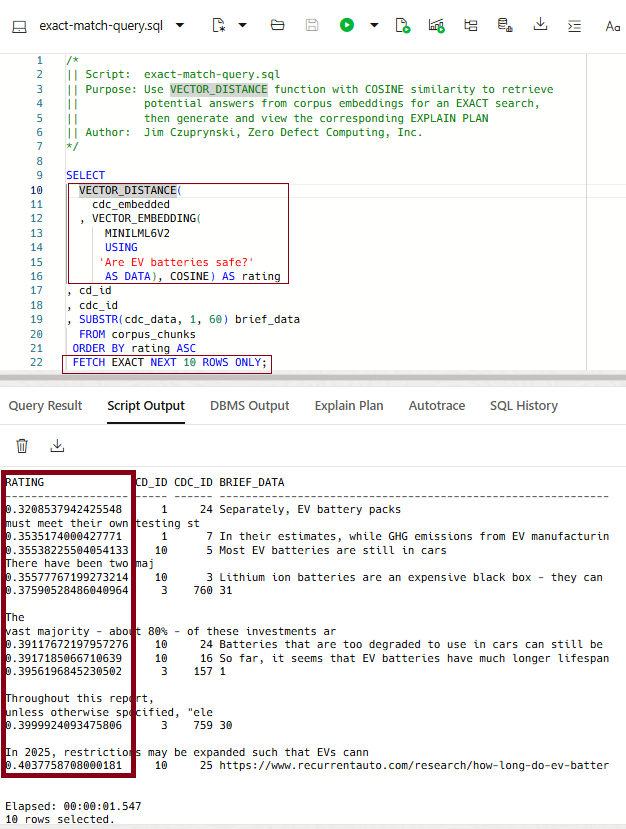
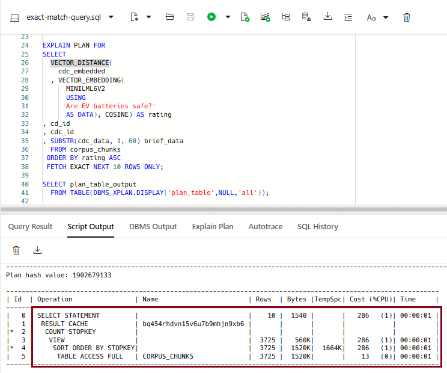
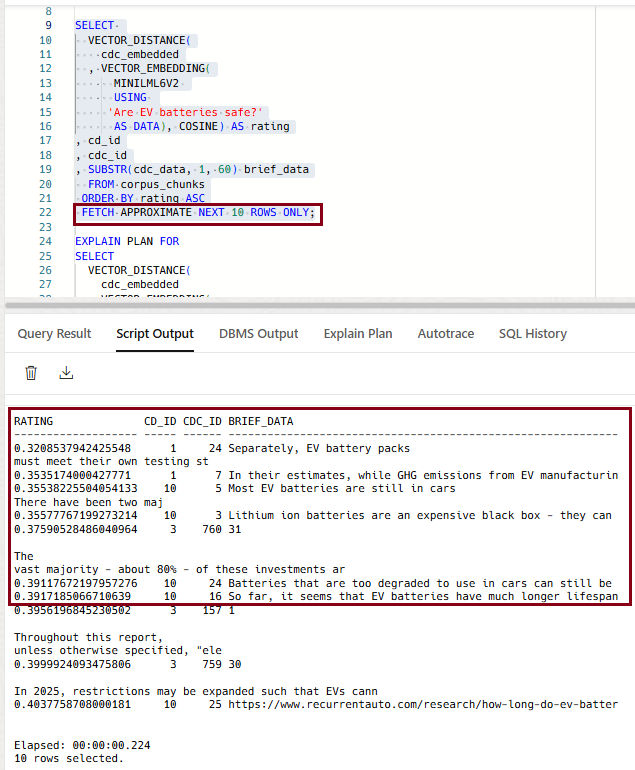
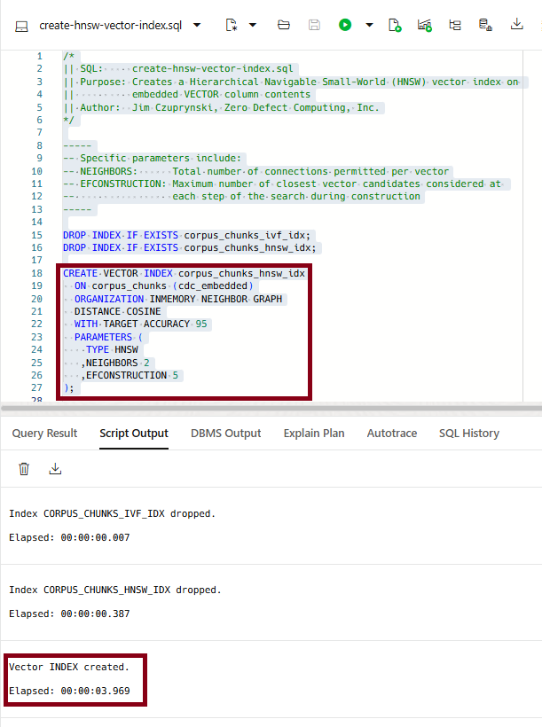
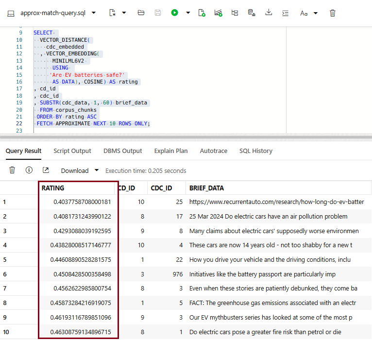
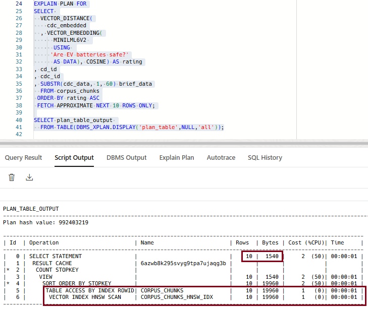
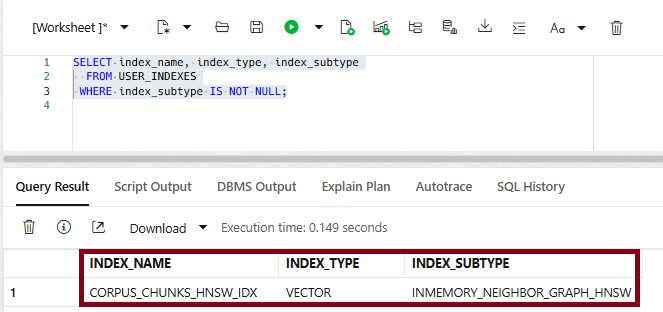
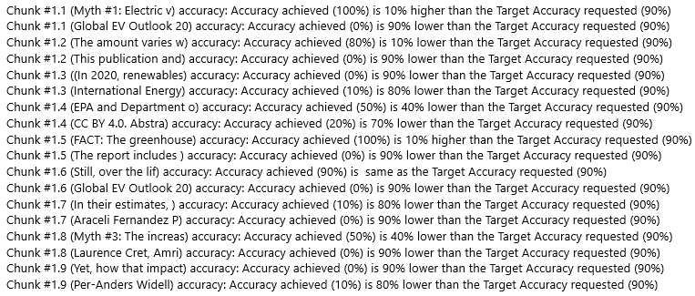

# Create Vector Indexes

## Introduction

The performance of SQL queries that search for an approximate match against embeddings are often improved by applying a *vector index* against the VECTOR datatype. In this lesson, we'll deploy one of several different vector index types available in 23ai - *Hierarchical Navigable Small-World* (HNSW) indexes - and briefly experiment with improving query performance through those indexing methods.

**Estimated Time: 10 minutes**

### Objectives

In this lab, you will:

- Create a vector index on the embeddings stored in the **CORPUS_CHUNKS** table
- Evaluate the HNSW vector index type and corresponding configuration options
- Explore the performance impact of vector indexes on approximate searches of embeddings in a SQL query

### Prerequisites

This lab assumes you have:
- Completed all previous labs successfully
- Are still connected to SQL Web Developer as the **HOL23** user

## Task 1: Discover Query Execution Methods Against Non-Indexed VECTOR Datatype
Let's explore the basics of accessing embeddings within our document corpus before we move on to the reason(s) for deploying vector indexes.

1. From your SQL Web Developer session, open the **exact-match-query.sql** script. This script will query the **cdc_embeddings** column in the **CORPUS_CHUNKS** table we populated in the prior lesson to locate the top 10 responses that best answer the query string *"Are EV batteries safe?"* with an *exact match* using the **VECTOR_EMBEDDING** function using *cosine distance*. 

   

   The **RATING** value that is returned from the VECTOR_EMBEDDING function that's part of 23ai's Vector Search capabilities. It uses the same LLM we used to create embeddings for the chunks we built from our document corpus in a prior lab to search through the embeddings and find the top 10 results that return an *exact* match for the phrase we supplied. The COSINE distance function is what differentiates which results best match; essentially, the *lower* the RATING value, the *better* the match. 

   The script then also generates and displays the corresponding **EXPLAIN PLAN** for this query. Note that this query accessed the **CORPUS_CHUNKS** table via a full table scan operation to locate the results.

   

2. Next, open and execute the  **approx-match-query.sql** script. It will issue a query against the **cdc_embeddings** column in the **CORPUS_CHUNKS** table to locate the top 10 responses that best answer the query string *"Are EV batteries safe?"* but with an *approximate match* using the **VECTOR_EMBEDDING** function using *cosine distance*. 

   

   However, note that the results are essentially *identical* even though  we asked for an *approximate* search instead of an exact search.
   
   

   In both cases, the entire table needed to be searched. For a small number of document chunks in a corpus like the one we've created, this may not cause significant execution delays, but obviously in a much larger corpus, a full table scan operation could take *much* longer.

## Task 2: Create Vector Indexes For Vector Datatype
Now let's see how adding a vector index may improve query performance significantly, using the same two queries from the prior task.

1. Let's add a vector index and see how that affects query performance. Open and execute the  **create-hnsw-vector-index.sql** script, which will drop any existing vector indexes and then create a new *Hierarchical Navigable Small-World* (HNSW) vector index on the **cdc_embeddings** column.

   

2. To observe the impact of the HNSW index on query performance, re-open and execute the **exact-match-query.sql** script.

   

   You'll notice the results are identical to the query's execution before the HNSW index was added; also, the corresponding EXPLAIN PLAN shows no difference. 

   

   The reason is that an exact search operation *cannot use a vector index*. However, as we'll see in a moment, an approximate search definitely can use a vector index for better performance.

3. Re-open and execute the **approx-match-query.sql** script and note the difference in what's returned.

   

   The returned results are *considerably* different for the *approximate* search; not only that, the values returned for **RATINGS** are also quite different. That's because the mining function was able to leverage a different LLM algorithm to search through the embeddings that are potentially better matches for the question posed?

   

   Also note that unlike the exact match query, the **CORPUS_CHUNKS** table was only accessed thru a search of the HNSW index for potential approximate matches. Even within our small corpus, this reduced the optimizer cost significantly - by a factor of almost **96%** (**10** with an indexed search, versus **282** for a full table scan without the index). While this level of resource savings may not hold true for *every* corpus searched, it portends significantly better performance for approximate searches of larger corpuses. 


## Task 3: Viewing Vector Index Metadata and Validating Index Selectivity
Let's now take a look at what's different about vector indexes, including how to validate the selectivity of a vector index using the **DBMS_VECTOR.INDEX_ACCURACY_QUERY** function.

1. To confirm some of the basic metadata about our HNSW index, copy this SQL query into the SQL worksheet and then execute it by clicking on the *Run Statement* button:

   ```
   <copy>
   SELECT index_name, index_type, index_subtype
   FROM USER_INDEXES
   WHERE index_subtype IS NOT NULL;
   </copy>
   ```
   

   Note the index type of **VECTOR** and the subtype of **INMEMORY_NEIGHBOR_GRAPH_HNSW** that indicate this index is specific to vector search capabilities in 23ai.

2. Next, open and execute the **validate-hnsw-vector-index.sql** script and review the results.

   

   This script uses the **DBMS_VECTOR.INDEX_ACCURACY_QUERY** function to determine the accuracy of the HNSW index *within an acceptable percentage*. In this example, we've set the acceptable performance threshold for the index to 90%. The script then uses a selective subset of document chunks - in this case, only those that belong to the corpus document with a CD_ID of 1 - and determines just how well the index performs against that threshold for those chunks, as shown below. 

   

3. **You've successfully created vector indexes for the embeddings that underlie your document corpus.** You may proceed to the next lab.

## Learn More
- [Vector Indexing Methods](https://docs.oracle.com/en/database/oracle/oracle-database/23/vecse/create-vector-indexes-and-hybrid-vector-indexes.html)
- [Vector Index Optimizer Plans](https://docs.oracle.com/en/database/oracle/oracle-database/23/vecse/optimizer-plans-vector-indexes.html)
- [Verifying Vector Index Accuracy and Efficiency](https://docs.oracle.com/en/database/oracle/oracle-database/23/vecse/index-accuracy-report.html)
- [Oracle SQL Web Developer Concepts and Usage](https://docs.oracle.com/en/cloud/paas/autonomous-database/serverless/adbsb/connect-database-actions.html#GUID-102845D9-6855-4944-8937-5C688939610F)

## Acknowledgements
* **Author** - [Oracle LiveLabs Contact], Jim Czuprynski
* **Contributors** - Jim Czuprynski, LiveLabs Contributor, Zero Defect Computing, Inc.
* **Last Updated By/Date** - Jim Czuprynski, February 2025